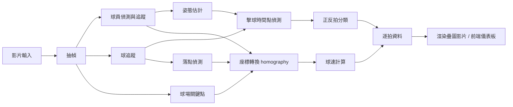

# 網球影片分析系統：技術規劃（參考 Rally AI）

> 對象：軟體工程師、專案經理
> 範圍：影片輸入 → 逐拍統計（擊球數、正反拍、球速）→ 疊圖影片輸出

---

## 1. 功能範圍

| # | 功能 | 使用者看到的結果 |
|---|---|---|
| F1 | 姿態骨架疊圖 | 球員身上的關節連線 |
| F2 | 擊球數統計 | Shot count |
| F3 | 正／反拍分類 | Fore / Back 次數、每拍 FH/BH 標籤 |
| F4 | 球速估算 | 平均球速、每拍球速長條圖 |
| F5 | 擊球序列 | 第 1～N 拍時間軸，當前拍高亮 |
| F6 | 影片與儀表板同步 | 播放進度對應目前第幾拍 |

---

## 2. 系統架構

建議第一版採**離線批次處理**（上傳 → 背景運算 → 輸出成品），不做即時推論。

---

## 3. 模組與技術選型

| 模組 | 建議方案 | 備註 | 算力 |
|---|---|---|---|
| 球員偵測與追蹤 | 物件偵測 + ByteTrack 類追蹤器 | 需鎖定「哪位球員」 | 中 |
| 姿態估計 | RTMPose（離線）／MediaPipe（手機端） | MediaPipe 預設單人，須先裁切球員區域 | 低～中 |
| 球追蹤 | TrackNet 系列 | 專為小、快、模糊的球設計；需 GPU | 中 |
| 球場校正 | 球場關鍵點偵測 + OpenCV homography | 只對地面上的點有效 | 低 |
| 落點偵測 | 球軌跡的垂直方向轉折 | 球速計算的前提 | 低 |
| 擊球時間點 | 球軌跡方向突變 + 揮拍姿態峰值 | 無現成方案，需自行開發 | 低 |
| 正反拍分類 | 骨架時序 + 輕量 LSTM/1D-CNN | 只分兩類，難度低於學術資料集的多類任務 | 低 |
| 渲染 | OpenCV／ffmpeg，或前端 Canvas | | 低 |

### 球速計算方式

飛行中的球不在地面上，不能直接用 homography 換算。建議做法：

1. 取擊球瞬間**球員腳的位置**（地面點）
2. 取該拍**球的落點**（地面點）
3. 兩點皆經 homography 換成球場座標（公尺）
4. 距離 ÷ 時間差 = 平均球速

限制：單鏡頭只能得到**估計值**，精度不及雷達；產品文案需避免宣稱精確測速。

---

## 4. 授權風險（商用前需法務確認）

| 元件 | 授權（依目前所知） | 商用影響 |
|---|---|---|
| MediaPipe | Apache 2.0 | 可商用 |
| RTMPose（MMPose） | Apache 2.0 | 可商用 |
| YOLOv8（Ultralytics） | AGPL-3.0 | SaaS 可能需開源或購買商業授權 |
| OpenPose | 非商業授權 | 不建議使用 |
| 公開資料集（如 THETIS） | 各自不同 | 多為研究用途，需逐一確認 |

---

## 5. 輸入規格需求

| 項目 | 建議 | 原因 |
|---|---|---|
| 幀率 | ≥ 60 fps | 30 fps 時球每幀移動約 1 公尺，模糊嚴重 |
| 機位 | 腳架固定、底線後方高處 | 需完整看到球場四角做校正 |
| 內容 | 純回合片段 | 廣告、換場畫面會干擾偵測 |

需在上傳流程加入拍攝指引與品質檢查（例如偵測不到球場四角就提示重拍）。

---

## 6. 開發里程碑（MVP）

| 階段 | 交付內容 | 驗收標準 |
|---|---|---|
| M1 | 姿態骨架疊圖影片 | 目標球員全程穩定追蹤 |
| M2 | 擊球時間點偵測 + 擊球數 | 與人工標註的擊球數比對 |
| M3 | 正反拍分類 | 分類準確率達預設門檻 |
| M4 | 球場校正 + 落點偵測 | 落點誤差在可接受範圍 |
| M5 | 球速估算 | 與雷達或已知數據比對誤差 |
| M6 | 儀表板 UI + 影片同步 | 逐拍資料與播放進度一致 |

M1～M3 不需要球追蹤，可先上線驗證需求；M4～M5 技術風險最高，應預留較多時間。

---

## 7. 主要風險

| 風險 | 影響 | 對策 |
|---|---|---|
| 訓練資料不足 | 公開資料多為轉播或實驗室畫面，與手機側拍差異大 | 編列標註人力與預算，建立自有資料集 |
| 標註成本 | 需標註擊球時間點、球位置、球場角點 | 先做半自動標註工具 |
| 球速精度 | 單鏡頭物理限制 | 定位為估計值；文案保守 |
| GPU 成本 | 球追蹤需 GPU | 批次排程、按影片長度計費 |
| 開源專案成熟度 | 現有網球專案多為研究原型，球場線與球員偵測不穩 | 只當起點參考，不直接上線 |

---

## 8. 技術參考

- TrackNet 實作與資料集：https://github.com/pdchyy/COSC681
- 網球追蹤開源範例（研究原型）：https://github.com/ArtLabss/tennis-tracking
- 球場關鍵點 + homography：https://arxiv.org/pdf/2507.20006
- 球員追蹤 + Kalman filter + homography：https://www.nepjol.info/index.php/injet/article/download/95782/72471/276096
